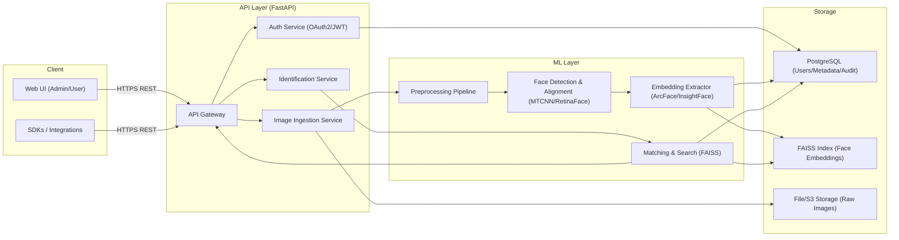

# System Architecture

## Overview

The face-recognition service follows a **microservices architecture**, dividing concerns into an API layer, an ML inference layer, and a data storage layer. Each service can be scaled independently.

## Component Diagram



## Service Responsibilities

### API Gateway (FastAPI)
- Central entry point for all client requests
- Request validation (Pydantic schemas), rate limiting, and routing
- Authentication enforcement via JWT middleware

### Auth Service
- Issues and validates JWT access/refresh tokens
- Manages user roles (admin, user)
- Stores token metadata in PostgreSQL

### Image Ingestion Service
- Accepts multipart image uploads
- Saves raw images to file/S3 storage
- Triggers the ML preprocessing pipeline asynchronously

### Identification / Verification Service
- Accepts a face image and returns matches from the vector index
- Verification (1:1) compares a query embedding to a user's stored embeddings
- Identification (1:N) runs ANN search across all enrolled faces

### ML Layer

| Component | Technology | Role |
|---|---|---|
| **Preprocessing** | OpenCV | Image resize, normalization, quality checks |
| **Face Detection** | MTCNN / RetinaFace | Bounding box + landmark detection |
| **Face Alignment** | OpenCV affine transform | Rotate/scale face to canonical pose |
| **Embedding Extraction** | InsightFace ArcFace (512-d) | Convert aligned face to embedding vector |
| **Matching** | FAISS (IVF-Flat or HNSW) | Approximate nearest-neighbor search |

### Storage Layer

| Store | Technology | Stores |
|---|---|---|
| **Metadata DB** | PostgreSQL | Users, face template records, audit logs |
| **Vector Index** | FAISS (file-backed) | 512-d face embedding vectors |
| **Image Store** | Local filesystem / S3 | Raw and cropped face images |

## Data Flow

### Enrollment Flow

```
Client → POST /api/users/{id}/faces (multipart images)
       → API validates JWT, writes to ImgStore
       → Sends to ML Pipeline:
           1. Detect & align faces
           2. Quality checks (blur, pose, occlusion)
           3. Extract ArcFace embeddings (512-d)
           4. Upsert embeddings into FAISS index
           5. Store face_templates record in PostgreSQL
       → Return { template_ids, status }
```

### Identification Flow

```
Client → POST /api/identify (image)
       → API validates JWT
       → ML Pipeline:
           1. Detect & align face
           2. Extract embedding
           3. ANN search in FAISS (top-K matches)
       → Join with PostgreSQL to get user metadata
       → Return { matches: [{ user_id, score }] }
```

## Scalability Considerations

- **API service**: Stateless — scale horizontally behind a load balancer
- **Model Server**: GPU-bound — scale vertically (larger GPU) or horizontally with sharded FAISS
- **PostgreSQL**: Scale with read replicas; consider connection pooling (PgBouncer)
- **FAISS**: For >1M faces, switch to Milvus/Qdrant with built-in clustering

## Security Architecture

- All client traffic over **HTTPS/TLS**
- Services in private network, only API Gateway exposed
- JWT tokens with short expiry (15 min) + refresh tokens
- Audit trail for all sensitive operations
