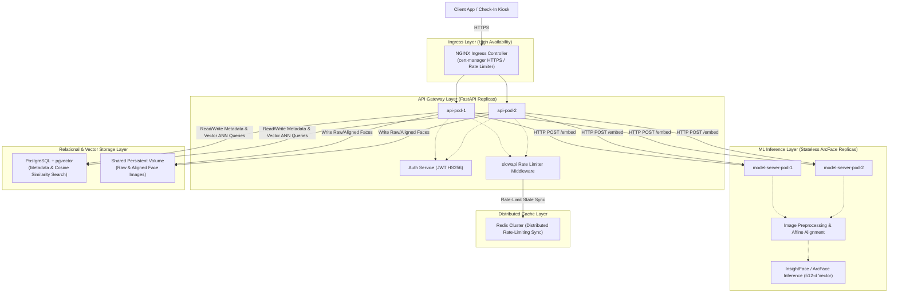

# System Architecture

## Overview

The face-recognition service is built using a modern, scalable, and highly available **microservices architecture**. By decoupling concerns into stateless API gateways, stateless ML inference servers, and a robust data/vector storage layer, each tier scales independently to handle high concurrent workloads.

---

## Component Diagram



---

## Service Responsibilities

### NGINX Ingress Controller
- Serves as the high-availability ingress endpoint, routing client request payloads securely.
- Performs TLS termination using certificates automatically requested/renewed by **cert-manager** (Let's Encrypt).
- Applies Ingress-level annotations for rate limiting and request body limits (`10MB`) as an initial shield.

### API Gateway (FastAPI Replicas)
- Stateless REST API pods running behind the Kubernetes ClusterService load-balancer.
- Performs authorization checks using JSON Web Tokens (JWT) signed with `HS256`.
- Evaluates endpoint-level rate limits utilizing `slowapi`, synchronized globally across replicas using **Redis**.
- Performs database operations via asynchronous SQLAlchemy connection pools.

### ML Inference Server (Stateless ArcFace Replicas)
- Purely stateless pods specialized in biometric extraction.
- **Image Processing**: Decodes incoming image files, verifies minimum resolution, and applies affine transformation/face alignment using OpenCV.
- **Biometric Embedding**: Generates high-fidelity 512-dimensional floating-point vectors from aligned faces utilizing ArcFace/InsightFace models.
- Since it retains no indexing state, it scales horizontally across GPU or CPU nodes seamlessly.

### Storage & Vector Search Layer (PostgreSQL + pgvector)
- A central database cluster backing the entire system.
- Serves as both the metadata repository (users, check-in records, audit logs) and the vector similarity engine.
- Biometric embeddings are stored as native `VECTOR(512)` columns.
- Similarity matching (1:1 and 1:N) is performed directly in the database using SQL queries invoking PostgreSQL's built-in `cosine_distance` metrics.
- Accelerated using an `ivfflat` index to achieve under 50ms query latencies for high-volume catalogs.

---

## Service Specifications

### ML Inference Pipeline

| Component | Technology | Role / Output |
|---|---|---|
| **Image Preprocessing** | OpenCV | Size normalization, luminance checks, blur analysis |
| **Face Detection** | RetinaFace / MTCNN | Locates faces, returns bounding boxes and landmarks |
| **Face Alignment** | Affine Transform | Rotates, scales, and aligns eyes/nose to canonical pose |
| **Feature Extraction** | ArcFace (InsightFace) | Synthesizes a highly discriminative 512-d feature vector |

### Storage Layer

| Store | Technology | Active Contents |
|---|---|---|
| **Metadata & Vectors** | PostgreSQL + pgvector | User profiles, audit logs, and native `VECTOR(512)` embeddings |
| **Distributed Cache** | Redis Cluster | Rate limit state storage (`slowapi` backend cache) |
| **Biometric Image Store**| Persistent Volume (S3/PV) | Cropped/aligned JPEG face images used for visual audits |

---

## System Data Flows

### Biometric Enrollment Flow

```text
Client → POST /api/users/{id}/faces (3 to 5 face JPEG images)
       → API Gateway authorizes JWT token
       → Writes raw JPEGs to image store (Persistent Volume)
       → API Gateway loops each image and calls Stateless ML Inference:
           1. Locates, crops, and affinely aligns the face template
           2. Inspects alignment quality & checks for blur/occlusions
           3. Extracts a 512-d ArcFace floating-point vector
       → API Gateway averages the successful embeddings into one template
       → API Gateway runs a SQL INSERT to write user face metadata and averaged vector directly into PostgreSQL
       → Return HTTP 201 Created { template_ids, status: "enrolled" }
```

### 1:N Identification & Check-In Flow

```text
Kiosk/Client → POST /api/checkin (JPEG image + Device-Token header)
             → API Gateway verifies device headers via Redis rate limiter
             → API Gateway requests Stateless ML Inference:
                 1. Locates, crops, and affinely aligns the probe face
                 2. Extracts a 512-d ArcFace vector embedding
             → API Gateway executes a pgvector cosine similarity query against PostgreSQL:
                 SELECT user_id, (1 - (embedding <=> :probe_vector)) AS similarity
                 FROM face_templates
                 WHERE (1 - (embedding <=> :probe_vector)) >= :threshold
                 ORDER BY embedding <=> :probe_vector LIMIT 1;
             → Database returns matching user_id and cosine similarity score
             → API Gateway verifies similarity against confidence threshold (>= 0.60)
             → API Gateway inserts a check-in event metadata row into Postgres
             → API Gateway publishes check-in record onto Live websocket clients
             → Return HTTP 200 OK { status: "SUCCESS", welcome_message: "Welcome..." }
```

---

## Scalability Considerations

- **API Replicas**: Fully stateless. Autoscale horizontally via Kubernetes Horizontal Pod Autoscaler (HPA) targeting `70% CPU`.
- **ML Replicas**: Stateless but CPU/GPU intensive. Scaled horizontally via HPA targeting `80% Memory` to absorb spike inference queries.
- **Database Scaling**: To support large user counts beyond 10,000 daily actives:
  - Configure **PgBouncer** inside Kubernetes to manage and multiplex connection pooling.
  - Implement read replicas to offload read-heavy 1:1 and 1:N searches from the primary write node.
  - Periodic database tuning (e.g., re-building the `ivfflat` index using `CREATE INDEX ... WITH (lists = ...)` as the embedding catalog expands).
