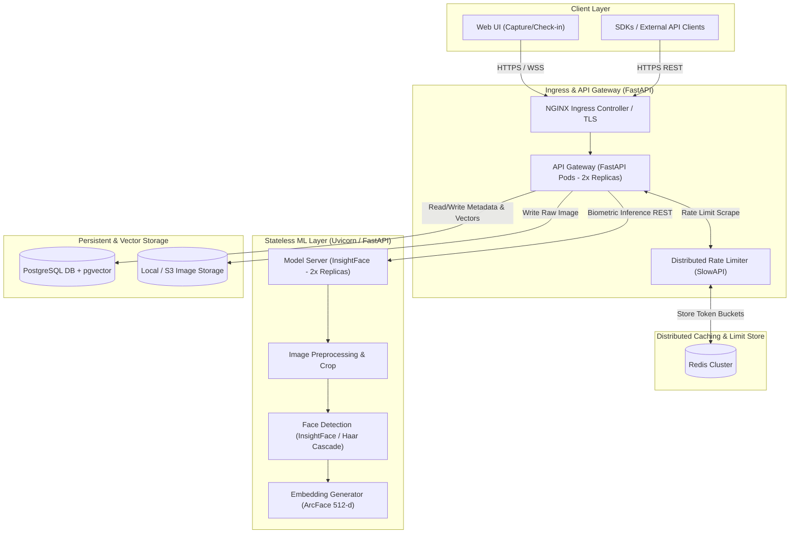

# System Architecture

## Overview

The face-recognition service is engineered as a highly scalable, mass-production-ready microservices architecture designed to process 10,000+ biometric transactions daily. Concerns are separated into an API Gateway layer, a stateless ML inference server, and a robust data layer leveraging native PostgreSQL `pgvector` index matching and Redis-based rate limiting.

## Component Diagram



---

## Service Responsibilities

### API Gateway (FastAPI)
- **High Availability**: Configured for 2+ replicas behind NGINX Ingress with Horizontal Pod Autoscalers (HPAs).
- **Distributed Rate Limiting**: Employs `slowapi` utilizing a shared **Redis backend** to prevent rate-limiting evasion across container replicas.
- **Biometric Orchestration**: Receives image uploads, runs ingestion workflows, and orchestrates verification (1:1) and identification (1:N) flows.

### Stateless Model Server (InsightFace + ArcFace)
- **Zero-State Design**: Operates purely as a stateless inference pipeline. It maintains no local vector databases or index files, allowing seamless scaling to N+ replicas.
- **Biometric Extraction**: Converts aligned face crops into mathematically optimized 512-dimensional vector arrays (`VECTOR(512)`).
- **Offline / Fallback Safety Nets**: Employs a global 85% center-crop safety net and average BGR-based identity mapping in fallback/offline modes, keeping testing robust under disconnected conditions.

### Storage & Matching Layer (PostgreSQL + pgvector)
- **Native Vector Indexing**: Completely deprecates FAISS. Face embeddings are stored natively inside PostgreSQL in a `VECTOR(512)` column.
- **Database-Level Similarity**: Matching is computed directly inside PostgreSQL using the `pgvector` cosine distance operator (`<=>`). This eliminates index replication lag and guarantees strict transaction atomicity (ACID).
- **In-Memory Dialect Fallback**: Under unit test suites (`pytest`), the system detects the SQLite dialect and performs in-memory cosine calculations via `FaceService._cosine_similarity`, while utilizing optimized native `pgvector` in production PostgreSQL environments.

---

## ML Pipeline Specifications

| Phase | Component | Technology / Algorithm | Purpose |
|---|---|---|---|
| **1** | **Preprocessing** | OpenCV | Image resizing, color space alignment (BGR), brightness validation. |
| **2** | **Face Detection** | InsightFace (buffalo_l) / Haar Cascade | Pinpoints bounding boxes and core coordinates. |
| **3** | **Face Alignment** | Affine Transformation | Translates, scales, and rotates face crop into canonical pose. |
| **4** | **Feature Extraction** | ArcFace (512-dimensional) | Extracts high-fidelity deep biometric features into floating-point vectors. |
| **5** | **Similarity Metric** | Cosine Distance ($1 - \text{sim}$) | Matches probe embeddings against gallery templates. |

---

## Storage Architecture

### PostgreSQL Schema
- **`users`**: Primary metadata registry for enrolled individuals.
- **`face_templates`**: Holds the `VECTOR(512)` embedding arrays mapped to `user_id` with a specialized index for rapid cosine distance lookups.
- **`checkins`**: Tracks access telemetry, status (SUCCESS/REJECTED), matching similarity scores, and timestamps.

---

## Data Flows

### Biometric Enrollment Flow
```
[Client App] ──( POST /api/users/{id}/faces )──> [API Gateway (FastAPI)]
                                                        │
                                          (Validate JWT & Rate Limits)
                                                        │
                                            [Stateless Model Server]
                                                        │
                                        (Preprocess -> Detect -> Align)
                                                        │
                                             (ArcFace 512-d Vector)
                                                        │
                                       [PostgreSQL (INSERT VECTOR(512))]
```

### Biometric Check-In (1:N) Flow
```
[Check-in Kiosk] ──( POST /api/identify )──> [API Gateway (FastAPI)]
                                                    │
                                         [Stateless Model Server]
                                                    │
                                         (Extract Probe Vector)
                                                    │
                                    [PostgreSQL (SELECT <=> Cosine Dist)]
                                                    │
                                      (Join User & Record Check-in)
                                                    │
[Access Granted/Denied] <──( JSON Success/Reject )──┘
```

---

## Scalability & Production Topology

- **Gateway Layer**: HPA scaling triggered at 70% CPU/Memory metrics.
- **Distributed In-Memory Store**: Redis stores short-term API keys and distributed rate limit counters.
- **Database Scaling**: Primary database manages pgvector matching. Scale-out strategies leverage PgBouncer connection pooling and Read Replicas for verification lookups.
