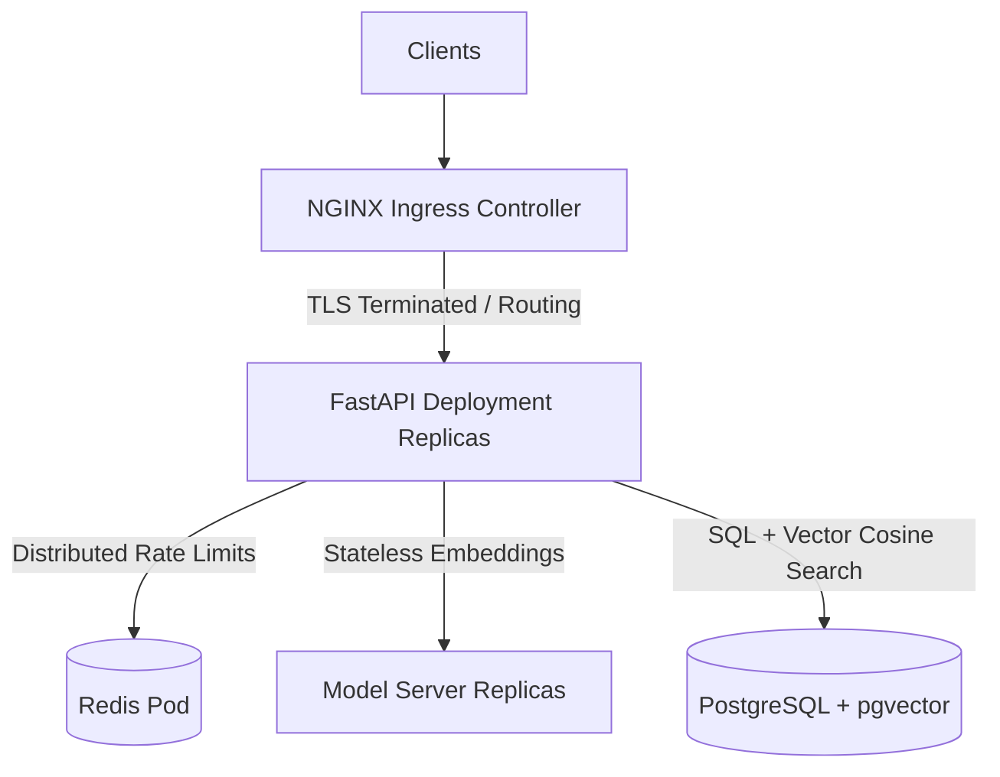

# Production Deployment Guide (Kubernetes HA & Docker Compose)

This guide details the procedures for deploying the Face Recognition stack into highly available, production-grade environments. To scale reliably to 10,000+ daily users, our primary deployment target is **Kubernetes**, which manages container orchestration, automatic horizontal scaling, TLS termination, and distributed rate limiting. 

A secondary, hardened **Docker Compose** configuration is also supported for local staging and single-VM hosting.

---

## 1. Primary Path: Highly Available Kubernetes

Deploying the stack to Kubernetes (EKS, GKE, AKS, or bare-metal) ensures high availability (HA) with automatic failover, AZ distribution, and horizontal autoscaling.



### Deploying the Manifests
Kubernetes manifests are organized under `deploy/k8s/`.

1. **Database & Caching Foundation**
   Ensure your target PostgreSQL database has the `pgvector` extension enabled. If you are not utilizing a managed database service (e.g., AWS RDS, GKE Cloud SQL), configure an in-cluster HA database.
   
   Deploy the Redis service for distributed rate-limiting:
   ```bash
   kubectl apply -f deploy/k8s/redis.yaml
   ```

2. **Secrets Configuration**
   Populate your production credentials (e.g., `DATABASE_URL`, `SECRET_KEY`, `CHECKIN_DEVICE_TOKENS`) in `deploy/k8s/secrets.yaml`. (Integrations with external systems like *External Secrets Operator*, AWS Secrets Manager, or GKE Secret Manager are recommended). Apply the secrets:
   ```bash
   kubectl apply -f deploy/k8s/secrets.yaml
   ```

3. **Deploy Stateless API & ML inference services**
   Deploy the services and their corresponding Horizontal Pod Autoscalers (HPAs):
   ```bash
   # Deploy stateless ML server
   kubectl apply -f deploy/k8s/model-server.yaml
   kubectl apply -f deploy/k8s/model-server-hpa.yaml
   
   # Deploy API Gateway
   kubectl apply -f deploy/k8s/api.yaml
   kubectl apply -f deploy/k8s/api-hpa.yaml
   ```

4. **Ingress and TLS Setup**
   Ensure an NGINX Ingress Controller is active in your cluster. Install **cert-manager** to handle automated Let's Encrypt TLS certificate provisioning. Then deploy the ingress manifest:
   ```bash
   kubectl apply -f deploy/k8s/ingress.yaml
   ```
   This terminates TLS at the ingress layer and applies maximum body constraints (`10MB`) to protect the gateways from excessively large image uploads.

---

## 2. Secondary Path: Single-VM Hardened Docker Compose

For rapid hosting, local staging, or single-host environments, deploy the hardened, TLS-enabled Docker Compose stack:

```bash
# 1. Clone repo & navigate to deploy directory
git clone <repo-url> && cd face-reg/deploy

# 2. Configure production variables
cp .env.production.example .env.production
nano .env.production # Set domain, passwords, secret key

# 3. Validate variables & bootstrap stack (validates env, builds containers, starts services)
chmod +x scripts/*.sh
./scripts/bootstrap-production.sh

# 4. Seed the initial admin account (startup bootstrapping is disabled in production)
./scripts/seed-admin.sh
```

---

## 3. High Availability & Scaling Configurations

### Horizontal Scaling & Az Anti-Affinity
Both the `api` and `model-server` deployments are configured for High Availability:
- **Min Replicas**: `2` (scales automatically based on demand).
- **Topology Spread Constraints**: Configured to spread pods across different Availability Zones (AZs) or nodes to prevent a single node failure from causing downtime.
- **Resource Requests & Limits**: Defined strictly to avoid resource starvation, especially for the heavy ML inference workloads (`model-server` replicas).

### Auto-Autoscaling Metrics
- **API Gateways**: Scale horizontally based on CPU utilization (targets `70% CPU`).
- **ML Inference Servers**: Scale horizontally based on Memory utilization (targets `80% Memory`), absorbing heavy batch inference demands.

---

## 4. Operational Runbook

### Health Auditing
- **Global Check**: `GET /api/health` returns status metrics of PostgreSQL, Redis connectivity, and the Model Server endpoint.
- **Service-Level Probes**: Kubernetes deployments utilize:
  - **Liveness Probes**: Check container viability at `/api/health` or TCP ports.
  - **Readiness Probes**: Validate database connection availability before routing traffic to the pod.

### Distributed Rate Limiting
Endpoint rate limiting is enforced via `slowapi` using a **Redis** storage backend. This keeps rate-limiting buckets perfectly synchronized across multiple API replicas, blocking brute-force login and check-in spam globally.
- **Login Endpoint**: Max 10 requests per minute.
- **Kiosk Check-In & Validation**: Max 30 requests per minute.

### Unified Relational & Vector Backups
Because similarity search was migrated from FAISS to **pgvector**, stateful file snapshots are completely deprecated. **All face templates and 512-dimensional vector embeddings reside natively in the PostgreSQL database cluster.**

Dumping the database captures all biometric states instantly:
```bash
# Backup
docker compose exec db pg_dump -U faceuser facedb > backup_facedb_$(date +%F).sql

# Restore
psql -U faceuser facedb < backup_facedb_yourdate.sql
```
> [!TIP]
> Standard database replication, automated snapshots, and Point-In-Time Recovery (PITR) systems natively backup and protect all face embeddings.

### Monitoring & Metrics Scraping
The production stack includes observability hooks:
- **Scrape Targets**:
  - API Gateway metrics: `http://<api-service>:8000/metrics` (Prometheus format)
  - ML Inference Server metrics: `http://<model-server-service>:8001/metrics`
- **Kubernetes Integration**: Deploy `ServiceMonitor` resources to automatically register the pods with your Prometheus Operator.
- **Grafana Visualization**: Access Grafana dashboard to track concurrent user transactions, validation latencies, embedding extraction queues, and database search speeds.
